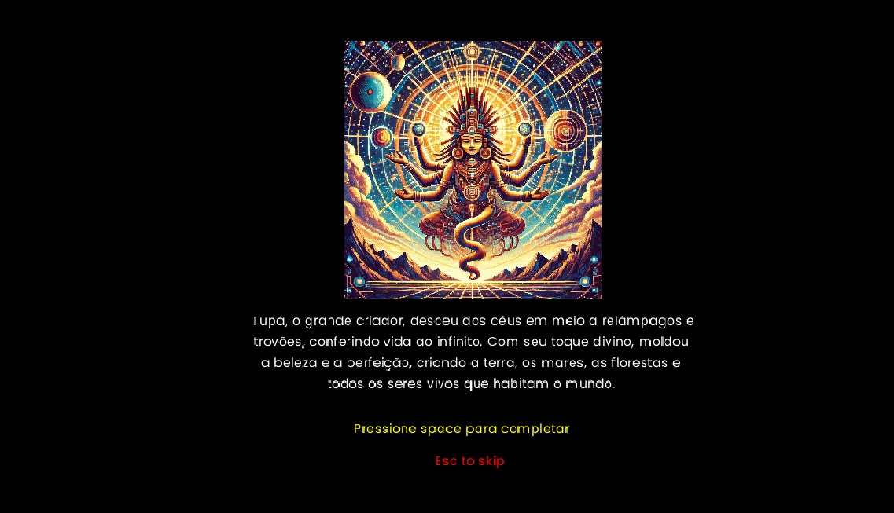
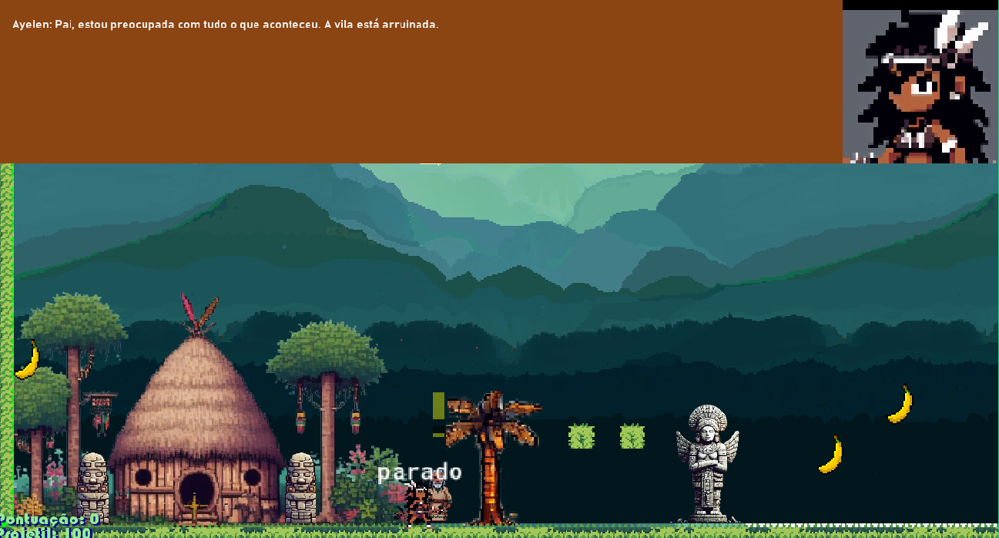
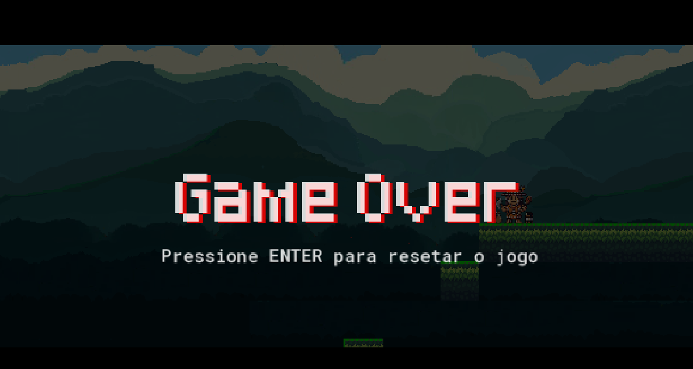
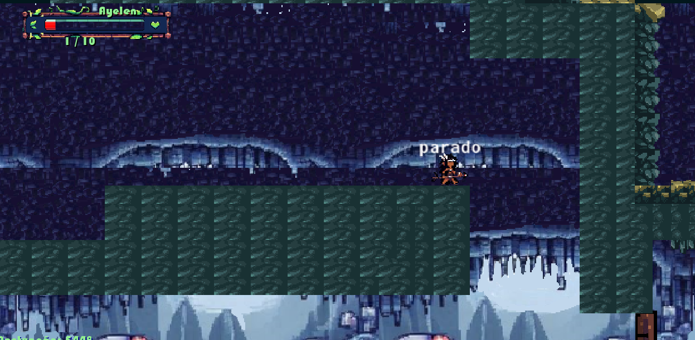
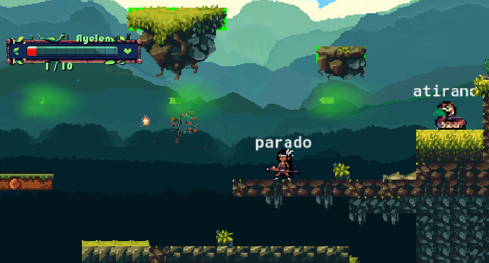
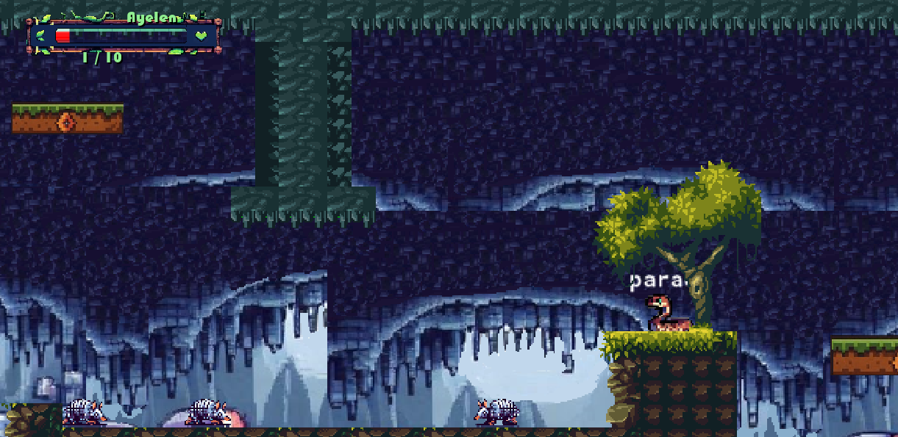
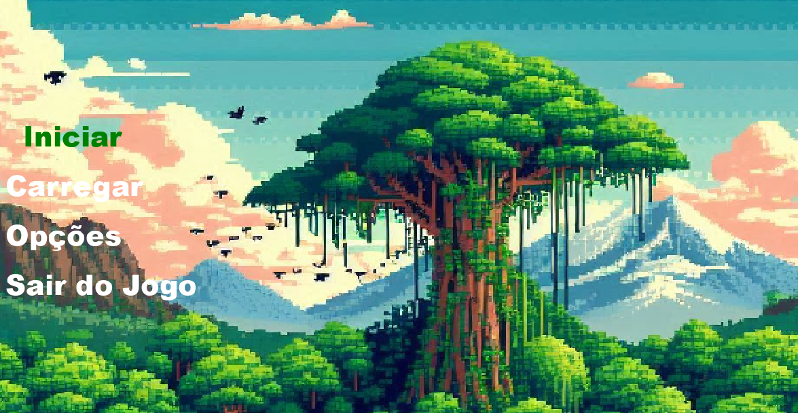
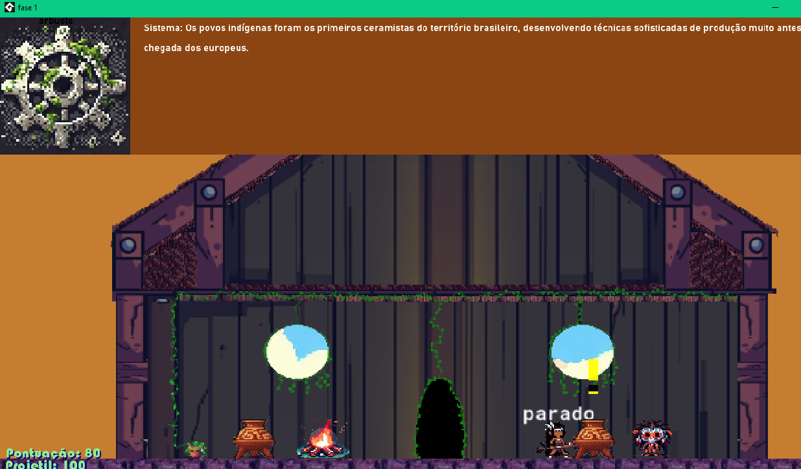
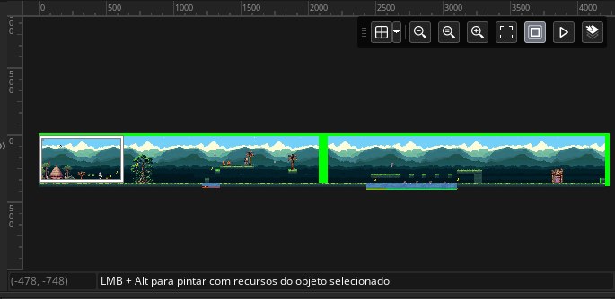

# ⚜️ A Saga Ayelen

## 🌐 Visão Geral  
Ayelen é um projeto  sobre a criação de um jogo narrativo inspirado nas mitologias e lendas tupi-guarani, trazendo uma história rica sobre o embate entre luz e trevas, a luta pela harmonia e o destino de uma vila protegida pelas constelações. A protagonista, **Ayelen**, é a guerreira destinada a restaurar o equilíbrio e salvar seu povo da destruição.

## ✨ Características do Projeto  
- 🔮 **Metodologia baseada na jornada do herói**  
- 🔮 **Mitologia e Tradição**: Inspirado nos deuses e espíritos do panteão tupi.  
- 🛡️ **Protagonista Forte**: Ayelen, a escolhida da Estrela Dalva, guiada pelos ancestrais.  
- 🛰 **Exploração e Descoberta**: Templos, lendas e mistérios ocultos esperam ser revelados.  
- 🌟 **Sistema de Constelações**: Três templos representam as constelações Homem-Velho, Anta-Norte e Veado.  
- 🧠 **Conflito e Redenção**: A traição de Ubiratã e a luta pela restauração das insígnias.

## 🔄 Contextualização  
A história começa com Tupã, o criador do cosmo. A vila de Ka'tupytã prosperou sob a proteção da deusa Bianca (fictícia), que lhes concedeu três templos sagrados. No entanto, a corrupção se infiltra quando **Ubiratã**, tomado pela ganância e magia negra, rouba as insígnias do templo da deusa.

Agora, com a vila à beira da destruição, os anciãos evocam uma profecia: apenas **Ayelen**, guiada pela luz da Estrela Dalva, pode restaurar o equilíbrio e impedir o avanço das trevas.

## 🎬 Personagens Principais  
- 🌟 **Ayelen** - A Guerreira da Luz  
- 🌌 **Tupã** - O Criador  
- 🌜 **Bianca** - A Deusa da Astronomia  
- 🔥 **Anhangá** - O Deus das Trevas  
- ⚔️ **Ubiratã** - O Guerreiro Caído

## 📚 Objetivos do Projeto  
- Criar um universo imersivo baseado na mitologia tupi.  
- Desenvolver um enredo envolvente com personagens profundos.  
- Explorar elementos culturais de forma respeitosa e autêntica.

## ✅ Planejamento e Roadmap  
1. Definição do Mundo e da Mitologia ✅  
2. Criação das Personagens ✅  
3. Desenvolvimento do Enredo ✅  
4. Prototipação do Jogo 🛠️  
    4.1. Criação dos sistemas de recompensa e objetivos ✅  
    4.2. Criação do menu + sistema de diálogos e cutscenes ✅  
    4.3. Criação do sistema de luta do player e inimigos ✅  
    4.4. Criação e refinamento de jogabilidade ✅  
    4.5. Criação e batalha com o primeiro chefe ✅  
    4.6. Design de níveis até o primeiro chefe 🛠️  
    4.7. Sistema de design de som 🛠️  
    4.8. Testes e finalização da prototipação ⭕    
    5.0. Apresentação ⭕  

## 📸 Prints  

  
  
  
  
  
  
  
  
  
  
  
  

📜 Menu de Opções
Interface onde o jogador administra sua jornada, ajustando configurações e decidindo seus próximos passos.

🌿 Progresso e Sistema de Artefatos
Representações do avanço do jogador, evidenciando a coleta de artefatos e o desbloqueio de novos níveis — símbolos do domínio e da superação dos desafios.

Progresso na Fase 3

Sistema de Artefatos

Sistema de Níveis

## 📈 Contribuição  
Sinta-se à vontade para sugerir melhorias, contribuir com ideias ou colaborar com o projeto! Qualquer feedback é bem-vindo.

## ✨ Contato  
Quer saber mais ou colaborar? Entre em contato via [GitHub](https://github.com/NebulaMystic) ou e-mail: [galvao.ti.solutions@gmail.com](mailto:galvao.ti.solutions@gmail.com) ou [gdszcoimbra@gmail.com](mailto:gdszcoimbra@gmail.com).ou 
fernando.costa2@estudante.ifb.edu.br(mailto:fernando.costa2@estudante.ifb.edu.br) martinhago225@gmail.com (mailto:martinhago225@gmail.com) 
